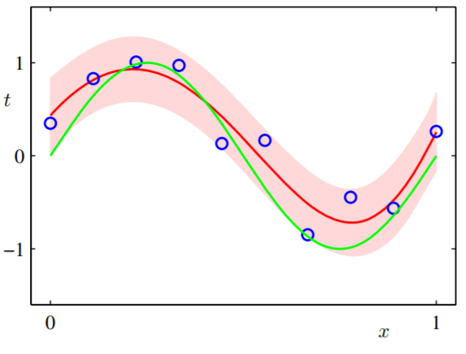
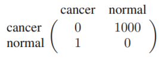

Contents
========

1.0 Introduction

1.1 Example: Polynomial Curve Fitting

1.2 Probabililty Theory

-   1.2.1 Probability densities
-   1.2.2 Expectations and covariabces
-   1.2.3 Bayesian probabilities
-   1.2.4 The Gaussian distribution
-   1.2.5 Curve fitting re-visited
-   1.2.6 Bayesian curve fitting

1.3 Model Selection

1.4 The Curse of Dimensionality

1.5 Decision Theory

-   1.5.1 Minimizaing the misclassification rate
-   1.5.2 Minimizing the expected loss
-   1.5.3 The reject option
-   1.5.4 Inference and decision
-   1.5.5 Loss functions for regression

1.6 Information Theory

-   1.6.1 Relative entropy and mutual information

1. Introduction
===============

-   Training set:
    **{****x****1****,** **.****.****.****,** **x****N****}**,
    to tune the parameters of an adaptive model
-   Target vector: **t**, the identity of the corresponding training set
    digit.
-   Training phase / Learning phase / Generalization
-   Preprocessing: to transform the original input variables into some
    new space of variables → easy to recognition pattern
    -   purpose: (dimensinolality reduction →) (1) feature
        extraction, (2) to speed up computation  
-   Application
    -   supervised learning: classification, regression
    -   unsupervised learning: clustering, density estimation
    -   reinforcement learning: finding suitable actions to take in a
        given situation in order to maximize a reward.

1.1 Example: Polynomial Curve Fitting
=====================================

**Goal**: to exploit the training set in order to make predictions of
the value *t̂* of the target variable for some new value *x̂* of the input
variable.

-   trying to discover the underlying function sin (2*π*)

-   *M* is order of the polynomial
-   *y*(*x*, **w**)is a nonlininear function of *x* and a linear
    function of the coefficients **w**.

**Step 1**: choosing the value of **w** to minimize error function,
*E*(**w**).

-   error function

-   by the sum of the squareds of the errors between the predictions
    *y*(*x**n*, **w**) for each data point *x**n*
    and the corresponding target value *t**n*
-   1/2: for convenience
-   result is positive quantity and that would be zero, iff the function
    *y*(*x**n*, **w**) were to pass exactly through each
    training data point.

*(ex.1.1)*

$${{\\partial{E}} \\over {\\partial{w\_i}}} = \\sum^N\_{n=1} \\{y(x\_n,\\mathbf{w})-t\_n\\}x^i\_n=0$$
$$\\sum^N\_{n=1} y(x\_n,\\mathbf{w})x^i\_n =\\sum^N\_{n=1} t\_nx^i\_n$$
$$\\sum^N\_{n=1} (\\sum\_{j=0}^{M}w\_jx\_n^j)x^i\_n =\\sum^N\_{n=1} t\_nx^i\_n$$
$$\\sum^N\_{n=1} \\sum\_{j=0}^{M}w\_jx\_n^{(j+i)}=\\sum^N\_{n=1} t\_nx^i\_n$$
$$\\sum^M\_{j=1} \\sum\_{n=0}^{N}x\_n^{(j+i)}w\_j=\\sum^N\_{n=1} t\_nx^i\_n$$
$$\\sum^M\_{j=1} A\_{ij}w\_j=T\_i$$

∴ the jcoefficients **w** that minimize the error function are given by
the solution to above set of linear equations.

**Step 2**: choosing the order *M* of polynomial (*model comparison* or
*model seleiction*)

-   over-fitting: eventhough, when polynomial passes exactly through
    each data point (*M* = 9), error function is 0,
    *E*(**w****\***) = 0, the fitted curve oscillates widly
    and gives a very poor representation of the function sin (2*π**x*).

-   **root mean squre error, RMS error**

-   the division by *N*: it could be to compare different sizes of data
    sets on an equal footing
-   square root: measured on the same scale as the target variable *t*.

-   (*over-fitting problem*) larger values of M → the more flexible,
    increasing the coefficients **w****\*** → increasingly
    tuned to the random noise on the target values

-   **over come the over-fitting problem**
    -   increaing the size of data set
    -   Bayesian method
    -   (for limit size) Regularization: adding the penalty term to the
        error function (1.2)

-   **Regularization**

-   *λ*: reactive importance of the regularization term compared with
    the sum-of-squres error term.
    -   zero: overfitting → desired: good for fitting → too large: poor
        fit
-   *w*0: normally omitted from the regularizer (∵ it depend
    on theh choice of orgin for the garget variable)
-   shrinkage method (e.g. ridge regression, weight decay,…)

 

1.2 Probabililty Theory
=======================

-   joint probability:
-   sum rule (marginal probability):
-   condition probability:
-   product rule:
-   Bayes’ theorem

-   independent: *p*(*X*, *Y*) = *p*(*X*)*p*(*Y*)

1.2.1 Probability densities
---------------------------

-   **probability density**: If the probability of a real-valued
    variable *x* falling in the interval (*x*, *x* + *δ**x*) is given by
    *p*(*x*)*δ**x*for *δ**x* → 0, then *p*(*x*) is probability density.

 s.t

-   probability density transforms (due to Jacobian factor)
    -   Jacobian factor:
        $J\_{ki}\\equiv {{\\partial y\_k}\\over{\\partial x\_i}}$
    -   if *x* = *g*(*y*), *f*(*x*) = *f̃*(*y*) = *f*(*g*(*y*)) →
        *p**y*(*y*) ≠ *p**x*(*x*)
    -   *(ex.1.4)* the concept of the maximum of a probability density
        is dependent on the choice of variable.

maximum value is calculated by
*d**p**y*(*y*)/*d**y*\|*ŷ* = 0

If *p**x*(*x*) = 2*x*, *x* ∈ \[0, 1\], the maximum value of
variable *x̂* is 1. And given that *x* = *s**i**n*(*y*), it transform to
the
*p**y*(*y*) = 2*s**i**n*(*y*)\|*c**o**s*(*y*)\|( = *s**i**n*(2*y*)), *y* ∈ \[0, *π*/2\],
and the *ŷ* is *π*/4. ∴ *x̂* ≠ *s**i**n*(*ŷ*)

-   **cumulative discribution function**: the probability that x lies in
    the interval ( − ∞, *z*)
-   **probability mass function** : *p*(*x*) when x is a discrete
    variable.

-   The sum and product ruels, Bayes’ therom of probability densities

1.2.2 Expectations and covariabces
----------------------------------

-   **expectation of *f*(*x*)**: weighted by the relative probabilities
    of the different values of *x*.

-   if there is N of points, the expectation can be approximated as

-   **conditional expectiation**

-   **variance**: measurment of how much variability there is in
    *f*(*x*) around its mean value 𝔼\[*f*(*x*)\].

-   **covariance**: expresses the extent to which *x* and *y* vary
    together. (if *x* and *y* is independent, cov=0)

(vector)

1.2.3 Bayesian probabilities
----------------------------

-   **Purpose**: to address and quantify the uncertainty that surrounds
    the appropriate choice for the model parameters **w**
-   **Bayes’ theorem**: at the uncertain event,
    -   1.  (prior probability) Suppose some opinion based on exist
            knowldge

    -   1.  obtain fresh evidence

    -   1.  (posterior probability) revise the uncertainty about
            (1)opinion

    -   that is, to convert a prior probability into a posterior
        probability by incorporating the evidence provided by the
        observed data

-   *p*(**w**): prior probability, assumptions about **w**, before
    observing the data
-   *p*(𝒟\|**w**), 𝒟 = {*t*1, *t*2, ..., *t**n*}
    : likelihood function, how probable the observed data set is for
    different settings of the parameter vector **w**
-   *p*(**w**\|𝒟): posterior probability, to evaluate the uncertainty in
    w after observing D.
-   *p*(𝒟): normalization constant

-   **Frequentist paradigms**
    -   frequentist estimator → maximum likelihood (maximize
        *p*(**w**\|𝒟))
    -   or minimize the *error* by the *error function*
-   **Bayesian view**: provide a quantification of uncertainty using
    probabilities.
    -   Advantage: the inclusion of prior knowledge arises naturally
    -   Criticism: at the prior distribution is often selected on the
        basis of mathematical convenience rather than as a reflection of
        any prior beliefs
    -   To reduce the dependence on the prior → noninformative priors
    -   Limitation: for using Bayeesian, need to marginalize over the
        whole of parameter space (it is difficult!)

1.2.4 The Gaussian distribution
-------------------------------

\ - precision: $1\\over{\\sigma^2}$

-   **vector form**

It is probability density

1.  𝒩(*x*\|*μ*, *σ*2) &gt; 0

2.  

*(ex.1.7)*

-   **expectation**

*(ex.1.8)*

-   **variance**
-   The maximum of a distribution is known as its mode. For a Gaussian,
    the mode = mean

*(ex.1.8)*

**Goal**: determine *μ*, *σ* parameters from the data set

-   **maximize the (log) likelihood function**

-   why log?
    -   1.  simplifies the subsequent mathematical analysis (2) good for
            underflow the numerical precision of the computer

-   **sample mean**: maximizint (1.54) whith respect to *μ*

*(ex.1.11)*

-   **sample variance**: maximizint (1.54) whith respect to
    *σ*2
    -   the solution (*μ**M**L*) and
        *σ**M**L*2is decopled. → calculation order
        does not matter

*(ex.1.11)*

-   **Limit: bias problem**
    -   *μ**M**L* is unbias, *σ**M**L*2
        is bias
    -   at the variance, bias (underestimat) → over fitting
    -   more complex models with many parameters → more bias → over
        fitting

1.2.5 Curve fitting re-visited
------------------------------

**Goal**: to predictions for the target variable *t* given some new
value of the input variable *x* on the basis of a set of training data
comprising *N* input values
*x* = (*x*1, ..., *x**N*)*T* and their
corresponding target values
*t* = (*t*1, ..., *t**N*)*T* (from a
probabilistic perspective)

*assume that it is a Gaussian distribution*

**Step 1**: usingthe training set {**x****,** **t**}→ finding an unknown
**w** & *β* by maximum likelihood

-   **w***M**L*: minimize
    ${\\beta \\over 2} \\sum\_{n=1}^N \\{y(x\_n,\\mathbf{w})-t \\}^2$
    (=1.2)
-   *β**M**L*:

-   Having determined the parameters **w** and *β* → predictive
    distribution that gives the probability distribution over *t*

**Step 2**: introduce a prior distribution for Bayesian approach

-   **prior**
-   *α*: precision (hyperparameter), *M* + 1:the total number of
    elements in the vector **w** for an *M**t**h* order
    polynomial
-   **posterior**
-   **MAP**: maximizing the posterior distribution, determine *w* by
    finding the most probable value of *w* given the data (a point
    estimate)
-   It is same as (1.4) with a regularization parameter given by
    *λ* = *α*/*β*.

1.2.6 Bayesian curve fitting
----------------------------

-   Marginalizations of **w** → predict **w** as a distribution

-   *p*(*t*\|*x*, **w**): (1.60), *p*(**w**\|**x**, **t**): posterior,
    normalizing the right-hand side of (1.66)

-   *β* − 1: the uncertainty in the predicted value of *t*,
    *ϕ*(*x*)*T***S***ϕ*(*x*): the uncertainty of **w** (a
    consequence of the Bayesian treatment)

1.3 Model Selection
===================

-   Select the number of free parameters (order)
-   In the maximum likelihood approach, the performance on the training
    set is not a good indicator of predictive performance on unseen data
    (∵ over-fitting)
-   ∴ setting a validation set → select the one having the best
    predictive performance
-   However, the supply of data for training and testing will be limited
    → **cross validation**
-   **cross validation drawback**:
    -   larger the number of factor of S, more the training runs
-   **Information criteria**
    -   akaike information criterion, AIC: add panalty term which is
        number of adjustable parameters at the log likelihood
    -   Bayesian information criterion, BIC (Section 4.4.1)
-   **Information criteria limits**:
    -   not take account of the uncertainty in the model parameters
    -   tend to favour overly simple model

1.4 The Curse of Dimensionality
===============================

-   **The Curse of Dimensionality**: when the dimensionality increases,
    the volume of the space increases so fast that the available data
    become sparse

*(example)*

-   As the number of input variables *D* increases, so the number of
    independent coefficients  ∝ *D*3
-   For a polynomial of order M, the number of coefficients
     ∝ *D**M*

1.5 Decision Theory
===================

-   When combined with probability theory, allows us to make optimal
    decisions in situations involving uncertainty
-   **Inference**: Determination of *p*(*x*, *t*) from a set of training
    data
    -   *p*(*x*, *t*): complete summary of the uncertainty associated
        with these variables
    -   any of the quantities appearing in Bayes’ theorem can be
        obtained from the joint distribution *p*(*x*, *t*) by either
        marginalizing or conditioning with respect to the appropriate
        variables

1.5.1 Minimizaing the misclassification rate
--------------------------------------------

**Goal**: to make as few misclassifications as possible

-   Decision region: a rule - *assigns each value of x to one of the
    available classes*- will divide the input space into regions
    ℛ*k* for each class, such that all points in
    ℛ*k* are assigned to class 𝒞*k*
-   Decision boundary or decision surface: the boundaries between
    decision regions

-   The optimal choice for *x̂* is where the curves for
    *p*(*x*, *C*1) and *p*(*x*, *C*2) cross,
    corresponding to *x̂* = *x*0, because in this case the red
    region disappears.

1.5.2 Minimizing the expected loss
----------------------------------

-   **cost function** or **loss function** : overall measure of loss
    incurred in taking any of the available decisions or actions,
    *L**k**j**p*(**x**, 𝒞*k*)

**Goal**: to minimize the total loss incurred

*(loss matrix)*

-   The loss function depends on the true class, which is unknown.

1.5.3 The reject option
-----------------------

-   somtimes *p*(𝒞*k*\|**x**) is too small (= joint
    distributions *p*(*x*, *C**k*)s are similar value)
-   In areas where it is difficult to make a decision, the reject option
    could be better

1.5.4 Inference and decision
----------------------------

-   Decision problem process: inference stage (train the posterior) →
    decision stage *or* using discriminant function
-   **(a) generative model**
    -   1.  solve theh inference problem, Determining the
            class-conditional densities *p*(*x*\|𝒞*k*) for
            each class 𝒞*k* individually

    -   1.  separately infer the prior class probabilities
            *p*(*C**k*)

    -   or model the joint distribution *p*(*x*, *C**k*)
        directly and then normalize
    -   1.  obtain the posterior probabilities

    -   Advantage: using *p*(*x*)→ outlier detection or novelty
        detection
    -   Limit: excessively demanding of data, to find the joint
        distribution

-   **(b) discriminative model**
    -   obtain a posterior probability directly
    -   1.  solve the inference problem

    -   1.  using the decision theory

    -   1.  to assign each new **x** to one of the classes

-   **(c) using discriminant function**
    -   discriminant function → directly assigning
    -   In this case, probabilities play no role
-   The reasons for the posterior probabilities
    -   Minimizing risk
    -   Reject option
    -   Compensating for class priors
    -   Combining models

1.5.5 Loss functions for regression
-----------------------------------

**Goal**: to choose *y*(*x*) so as to minimize the average, or expected,
loss 𝔼\[*L*\].

-   A common loss function in regression problems:
    *L*(*t*, *y*(**x**)) = {*y*(**x**) − *t*}2

-   **Regression function**: the conditional average of *t* conditioned
    on **x**
    -   The regression function *y*(*x*), which minimizes the expected
        squared loss,is given by the mean of the conditional
        distribution *p*(*t*\|*x*).

*(appendix D)*

-   slightly different way,

-   second term
    -   the variance of the distribution of *t*, averaged over **x**
    -   the irreducible minimum value of the loss function, noise
-   another loss function: Minkowski loss

1.6 Information Theory
======================

1.6.1 Relative entropy and mutual information
---------------------------------------------
